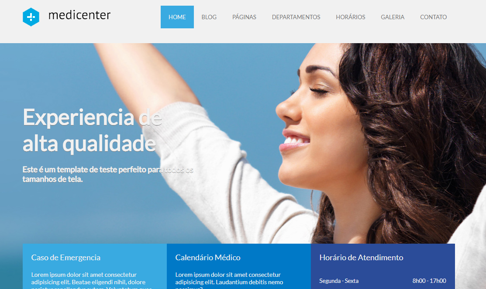

<h1 align="center">
  Medicenter Flexbox
</h1>

## 📋 Índice

- [Preview](#-Preview)
- [Sobre](#-Sobre)
- [Tecnologias utilizadas](#-Tecnologias-utilizadas)
- [Como executar o projeto](#-Como-executar-o-projeto)

---

## 🖥 Preview

  

---

## 📖 Sobre 

Este site foi desenvolvido com o objetivo de recriar um template para clínicas médicas, neste site em específico o foco foi aplicar o flexbox assim fixando os conhecimentos aprendidos desta tecnologia do CSS3.

---

## 🚀 Tecnologias utilizadas
O projeto está sendo desenvolvido com as seguintes tecnologias:
- HTML5
- CSS3

---

## ⌨ Como executar o projeto

Baixe o arquivo .ZIP do projeto e após descompactar abra o arquivo index.html

---

